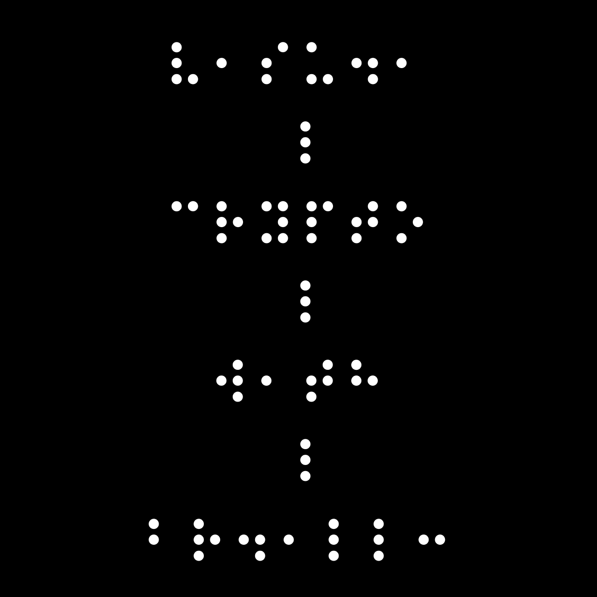

# Tactile

## Challenge Description

 
Are you blind?? 🤨

**Include your flag inside the flag format; i.e. hacktoberfest_ctf{FLAG}!**

## Challenge Hints

- How about visual cryptography?
- Read the Title!

## Challenge Flag

**hacktoberfest_ctf{V1SU41_CRYPTO_W1TH_BR41LL3}**

## Challenge Files

- [tactile.png](tactile.png)

