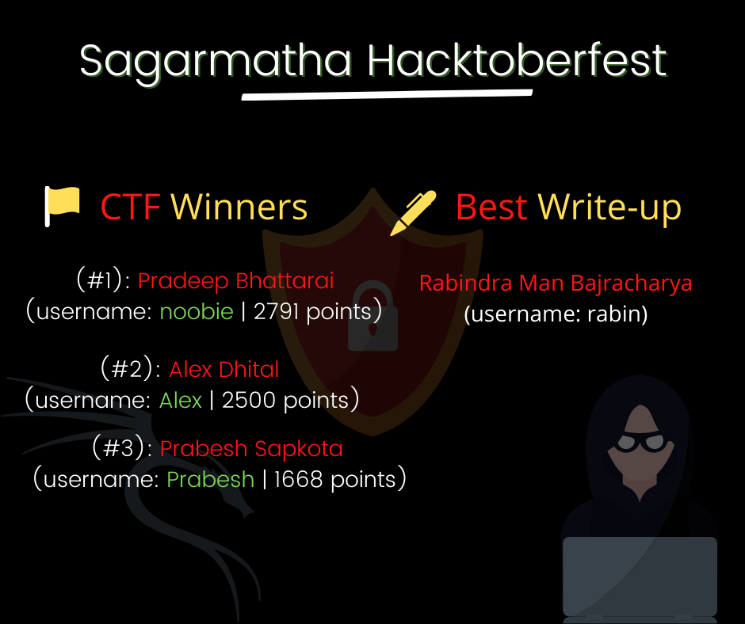

# Hacktoberfest CTF

# The CTF has ended. You can submit your write-ups.

You are requested to send PRs with the write-ups to the challenges you had sovled; PRs are welcome!!

## Welcome

This is a guide with the intention of taking you through the process of learning how to play [Capture the Flag](https://en.wikipedia.org/wiki/Capture_the_flag#Computer_security) (CTF) and being part of open-source community. Our intention here is simply to provide you with the tools you need to become familiar with the game and get started on your quest to become a good hacker.

## Challenges Types

- Cryptography ( 5 )
- Misc. ( 3 )
- Reversing ( 4 )
- Web ( 2 )
- OSINT ( 3 )

## Winner Announcement

## TL;DR

- CTF has now ended!!
- ~~Please do not leak hints and flags in PRs~~, PRs are now all welcome!!
- To win, you would have had to make PRs at the end of the program.
- Winners have been announced.
- Winners have be rewarded with **JetBrains** and **GitKraken** Premium Key :tada: 

