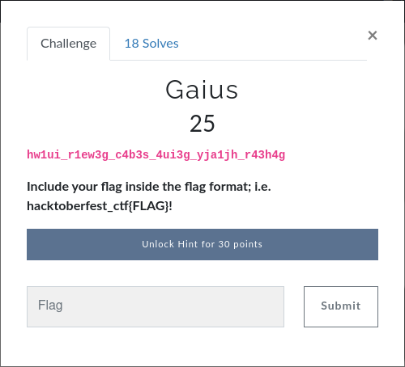
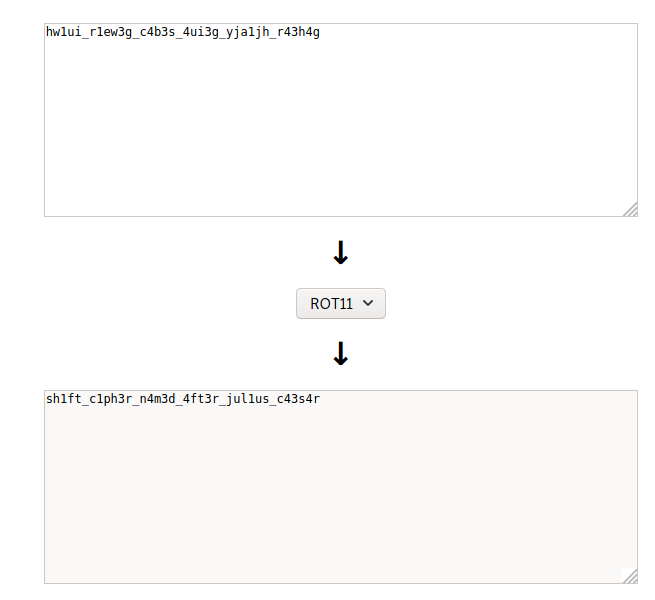

# Prabesh01 - Gaius

## Challenge:

## Challenge Flag: hacktoberfest_ctf{sh1ft_c1ph3r_n4m3d_4ft3r_jul1us_c43s4r}

## Write-up:

What I have is: hw1ui_r1ew3g_c4b3s_4ui3g_yja1jh_r43h4g.  Looks like some weird jumbled letters, right?. As I have already face this kinds challenge earlier in other ctfs, I quickly visited https://rot13.com/ and pasted it there and got the flag at rot 11.

As additional info, if you faced such jumbled letters while playing ctfs, it not necessary that its encoded with rot. It might also be <a href="https://www.dcode.fr/caesar-cipher">caesar cipher</a> or something else.
