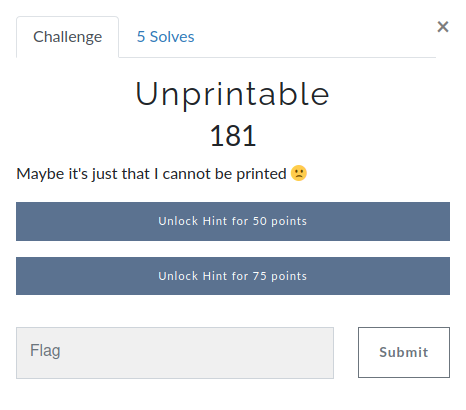
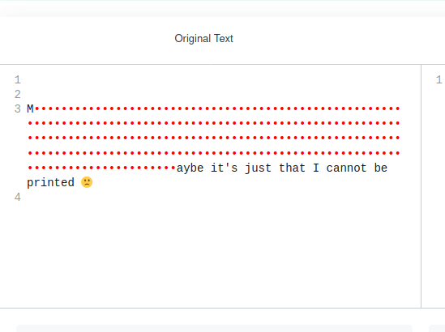
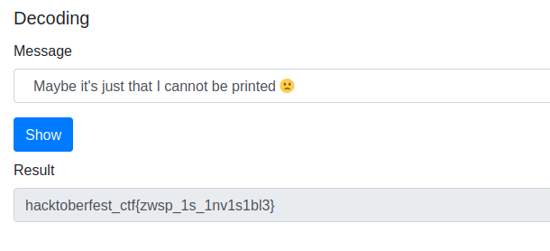

# Prabesh01 - Unprintable

## Challenge:

## Challenge Flag: hacktoberfest_ctf{zwsp_1s_1nv1s1bl3}

## Write-up:

As its name says " Unprintable", I already had idea that it migtht be related to zero-width character. To be sure I copied the text and pasted <a href="https://www.diffchecker.com/">here</a>. and I got this: 

 
After being sure I jus decoded it using <a href="https://offdev.net/demos/zwsp-steg-js">this site</a> and got the flag: hacktoberfest_ctf{zwsp_1s_1nv1s1bl3}
 

