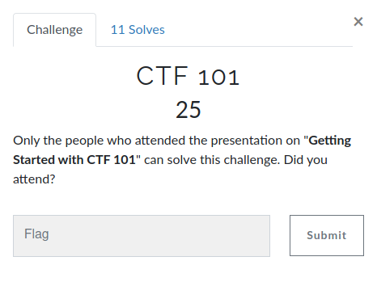
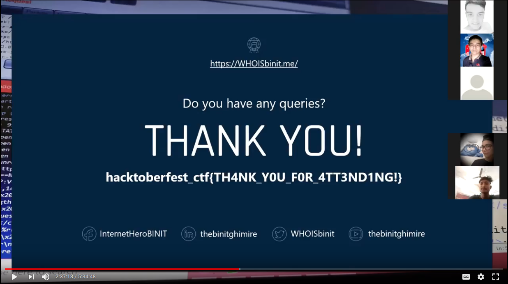

# Prabesh01 -  CTF 101 

## Challenge:

## Challenge Flag: hacktoberfest_ctf{TH4NK_Y0U_F0R_4TT3ND1NG!}

## Write-up:

Actually, I could't attend the presentation due to whole day powercut in my area. But luckily, the organizer had recorded the seminar and posted the link in event page.
  
  

  
  
So, I followed <a href="https://drive.google.com/file/d/1PooTWMsQ3PLbQKSre_PRQZ1yg7fNypS1/view?fbclid=IwAR0e8J5WAQBSZGnnP7uRNaRgl4HfBh72EAb-tXNrq-HsN49Gi7aF7CPYGt8">the link</a>. I was initially planning to directly skip to binit's presentation and get the flag but the program was just so awesome that I watched it all :D
  
Anyways, got the flag: hacktoberfest_ctf{TH4NK_Y0U_F0R_4TT3ND1NG!}
  
  

