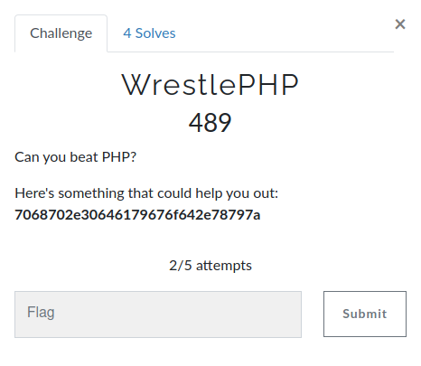
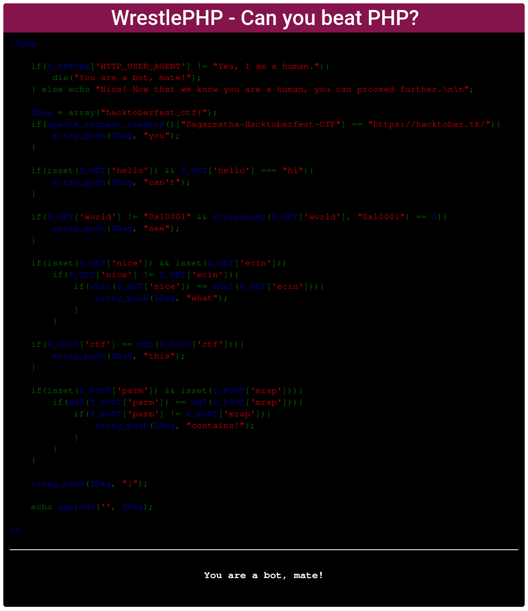

#  Prabesh01 - WrestlePHP

## Challenge:

<a href="https://hacktober.tk/challenges#WrestlePHP-24">
</a>

## Challenge Flag: hacktoberfest_ctf{3qu4l17y_1s_n07_1d3nt17y_hehe_1337_0xcafebabe_cafedead}

## Write-up:

_Note: If you don't feel comfortable reading this writeup, you could see a quick walkthrough video from <a href="https://drive.google.com/file/d/1uGB1zKwtaMVDblpu9r9a5svLzB7liQGS/view?usp=sharing">here</a>. I have done slightly differently than what's written in this writeup. The main idea is same though._

_Here is a one-liner solution for some lazy folks out there:_ </br>
```curl -H "User-agent: Yes, I am a human." "https://php.0daygod.xyz/?hello=hi&world[]=&nice[]=admin&ecin[]=hello" -d "parm=QNKCDZO&mrap=240610708&ctf=0e1137126905" -H "Sagarmatha-Hacktoberfest-CTF: https://hacktober.tk/" | grep Flag```

_So, let's beat PHP_

The only thing we have is this: "7068702e30646179676f642e78797a". What could this be? Ofcourse, it's some kind of encoded text. To decode it, we first need to find out which algorithm it is encoded with. To do so, just use any cipher identifier. I used <a href="https://www.boxentriq.com/code-breaking/cipher-identifier">boxentriq's cipher identifier</a>. From analysis result, we get that the cipher used is hexadecimal. So lets decode it. Again, you can use any hexadecimal decoder. I used <a href="https://cryptii.com/pipes/hex-decoder">cryptii's hex decoder</a>. After decoding, we get this: php.0daygod.xyz.
Looks like a url, right? Visitng the url takes us to the site stating "WrestlePHP - Can you beat PHP?". 

<a href="https://php.0daygod.xyz/">
</a>
<br>
Since I had already played such kinda ctf before, I had the rough idea of how to solve this one. Starting from the top of the code, the first if else codition is checking if the useragent is "Yes, I am a human.". If not, it would print "You are a bot, mate!" which can be seen at the bottom of the site. So I intercepted the requst to the site with burpsuite, changed the useragent value with "Yes, I am a human." and forwarded it. In the browser, at the bottom of the site, we can see that the text "You are a bot, mate!" has changed into "Nice! Now that we know you are a human, you can proceed further.". We also got the flag format of the challenge. Now that I know what's going on, I intercepted the request again and sent it to the repeater. 
<br><br>
Now, we have passed the first check. Now keeping the useragent unchanged, we move to the next if else conditional check. The second check is checking for request header. It checks if the header "Sagarmatha-Hacktoberfest-CTF" is present with its value "https://hacktober.tk/". So I went back to the repeater and added the header "Sagarmatha-Hacktoberfest-CTF" with its value "https://hacktober.tk/". At the end of the response tab, we god the first word of the flag: `hacktoberfest_ctf{3qu4l17y}`.
<br><br>
Now that we have passed the second check, lets see what the third one wants. Looks like the third check is looking for get request "hello" withits value set to hi. Easy, right? In repeater, i edited the first line from `GET / HTTP/1.1` to `GET /?hello=hi HTTP/1.1`. In response, we got: `hacktoberfest_ctf{3qu4l17y_1s_n07_}`. 
<br><br>
Lets move on to the fourth check. This one is little tricky, it is checking for a get request named world whose value must not be equal to "0x10001". Not a problem yet. But a strcasecmp function is being used. In short, strcasecmp function checks if two strings are same or not  and this function is case insensitive. For an example, `strcasecmp("apple", "apple")` returns 0 because both the strings are same. If they aren't same, it will return something else other then zero. So, in this fourth check, it says the output of `strcasecmp($_GET['world'], "0x10001")` must be zero, which means they must be equal. Wierd, right? the code is saying that the value of get parameter world must not be "0x10001" but at the same time it must be "0x10001". How the hell is this possible??!! But its easy, thee tricky part here is the equal sign. Did you noticed, in the third check, there was triple eual sign used `$_GET['hello'] === "hi"`. But in this code only double equal sign is used. This is gonna help us pass this check. It would take much time to explain this but in short, using double equal for comparing strings in PHP is unsafe. It is loose comparison. Read more about this from <a href="https://www.netsparker.com/blog/web-security/type-juggling-authentication-bypass-cms-made-simple">here</a> or google yourself. Ok, to bypass it just replace the first line from `GET /?hello=hi HTTP/1.1` to `GET /?hello=hi&world[]= HTTP/1.1`
In response, the flag we got is : `Flag: hacktoberfest_ctf{3qu4l17y_1s_n07_1d3nt17y}`
<br><br>
3 more to go. Fifth check can also be solved similary as the fourth one since it too uses double equal comparison. Now, our first line in request will be `GET /?hello=hi&world[]=&nice[]=anything&ecin[]=something HTTP/1.1`. Sending this request gives us this flag: `hacktoberfest_ctf{3qu4l17y_1s_n07_1d3nt17y_hehe_1337_}`
<br><br>
Looking at the code of our second last check, it is seeking for a post request with its name ctf whose value must be equal to its own md5 hash. Now this is a rare case. Anyway, I tried to make post  request to the site using burpsite but for some reason i wasn't able to do so. I didn't had much time to try to fix it since it was like 9:30 Pm and my parents could turn off the wifi router any minute. SoI tried to curl using this command: ```curl -H "User-agent: Yes, I am a human." "https://php.0daygod.xyz/?hello=hi&world[]=&nice[]=admin&ecin[]=hello" -d "ctf[]=something" -H "Sagarmatha-Hacktoberfest-CTF: https://hacktober.tk/" | grep Flag```. For some reason ctf[]= didn't worked this time. Since, I din't had much time, I searched if there is really a string whose md5 hash is equal to itself. The I got to <a href="https://github.com/ryanking13/ctf-cheatsheet/blob/master/Cryptography/Useful_Hashes.md">this github repo</a>. Acyually, no string has been discovered whose md5 hash is completely same as itself but there are few whose initial characters are same. Since the double equal is used here, it will accept it since it is a loose comparison.  So our command becomes like this:
```curl -H "User-agent: Yes, I am a human." "https://php.0daygod.xyz/?hello=hi&world[]=&nice[]=admin&ecin[]=hello" -d "ctf=0e1137126905" -H "Sagarmatha-Hacktoberfest-CTF: https://hacktober.tk/" | grep Flag```
<br><br>
Finally we are on the last check. Honestly, writing this writup sucked more then solving the that tweet tweet challenge from OSINT. Ok, then the code is looking for post request with header parm and mrap whose value mustn't be equal but their md5 hash must be equal. I had already seen this kinda challenge in previous ctfs, so it was too easy for me. But when I faced this challenge for the first time, I was like wtf! How can this be possible. I googled it and found the solution hardly. The answer is 240610708 & QNKCDZO. The logic is same as that of the previous check. SO, our final command is: 
```curl -H "User-agent: Yes, I am a human." "https://php.0daygod.xyz/?hello=hi&world[]=&nice[]=admin&ecin[]=hello" -d "parm=QNKCDZO&mrap=240610708&ctf=0e1137126905" -H "Sagarmatha-Hacktoberfest-CTF: https://hacktober.tk/" | grep Flag```
<br><br>
And our final flag is : hacktoberfest_ctf{3qu4l17y_1s_n07_1d3nt17y_hehe_1337_0xcafebabe_cafedead}

